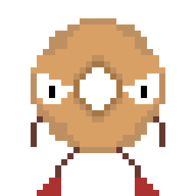

## Bagel

	

Bagel is 2D cross-platform video game about about bagel who must save all the toppings it can from the freak fires sparking all throughout the city.

## Technology 

- Framework: [MonoGame](https://www.monogame.net/)
- Entity-Component-System: [DefaultECS](https://github.com/Doraku/DefaultEcs)
- Physics Engine: [Aether.Physics2D](https://github.com/tainicom/Aether.Physics2D)

## How To Play

To move the player use your keyboards A and D key. The objective of the game is to catch as many falling toppings as possible without fail. Your score is displayed in the top right corner of the screen.

	

